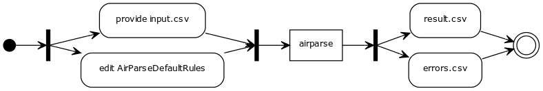
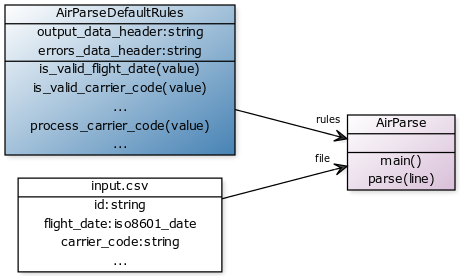

# airparse 1.0.2
a lightweight and dumb csv parser with custom validations and data processing rules

## Short description

Provide an input csv file, code a ruby validator for any column, code a processor for any column (skip if you don't want to modify/normalize any data), run ./airparse.rb with options from command line for instant results.

## Usage

```
ruby airparse.rb -h
Airparse is a lighweight csv parser/validator/processor.
It can be used to parse any csv file, validate each value with
a custom validator method. Optionally, each value can be further
processed/formatted before being output to the result file.

Input/output files must be specified as command line params,
custom validators/processors can be defined
in the default lib/airparsedefaultrules.rb file or any user defined file.

Optionally, a different rules file can be specified.

Usage:
       ./airparse.rb [options] --file <filename> --output <filename> [--rules <ClassName>] [--errors <filename>]

where [options] are:
  -v, --verbose       Verbose debug output
  -f, --file=<s>      CSV filename to parse
  -o, --output=<s>    output filename
  -e, --errors=<s>    errors filename (default: errors.csv)
  -r, --rules=<s>     rules Class name (use camelcase, filename containg the specified class should be named after the
                      Class, but lowercase; all rules files must be located within lib/ folder) (default:
                      AirParseDefaultRules)
  -i, --iters=<i>     Number of iterations (for stress testing) (default: 1)
  -s, --version       Print version and exit
  -h, --help          Show this message
```

## Idea/rationale

1. Sometimes you need to validate and/or process/fix/normalize a dirty data file (csv) before importing it to a nosql or db system.
2. You don't want to use any heavy and hard to learn/install pipeline/smart/xsl/xmlconfig/java/visual mumbo/jumbo.
3. You don't want to clutter your main app with a 'use_only_once' import/data cleansing code.
4. You want to be efficient and flexible, so use pure ruby with all libs/gems.
5. Airparse takes care of the common stuff like file io/error handling.
6. You take care of the validator/processor code isolated in simple functions/methods in a user editable Ruby Class.

## Features

1. command line interface with just a few switches to remember
2. user editable rules: written as standard ruby classes are located in 'lib/' folder; you do not need to code any validators/processors for the data columns before running; you can add them later as required.
3. full cucumber/aruba/gherkin test coverage included

## Flow diagram



yuml.me:
```
(start)->|a|,|a|->(provide input.csv)->|b|,|a|->(edit AirParseDefaultRules)->|b|,|b|->[airparse]->|c|->(result.csv)->(end),|c|->(errors.csv)->(end)
```


## Class diagram



yuml.me:
```
[input.csv|id:string;flight_date:iso8601_date;carrier_code:string;...{bg:white}]---file>[AirParse||main();parse(line){bg:thistle}]
[AirParseDefaultRules|output_data_header:string;errors_data_header:string|is_valid_flight_date(value);is_valid_carrier_code(value);...;process_carrier_code(value);...{bg:steelblue}]---rules>[AirParse||main();parse(line){bg:thistle}]
```


## Algorithm

airparse.rb script calls AirParse.process method for the file specified

AirParse.process has a loop that iterates each *line* and each *value*

all atomic values are checked with AirParseDefaultRules.is_valid_* function and processed with AirParseDefaultRules.process_* method


## Installation/how to use (in 3 minutes)

0. req: ruby >= 2.1, gems: cucumber, aruba, trollop
1. clone this repo: `git clone https://github.com/metack/airparse.git` & `cd airparse`
2. install gems: `bundle install`
3. run with a sample input file and settings: `./run.sh`
4. check `results.csv` and `error.csv`
5. run tests: `test/test.sh` & `test/test_dump.sh`
6. check `test_results.txt`
7. check the other switches `./airparse.rb --help`
8. play yourself: `./airparse.rb -f sample_data.csv -o result.csv -e errors.csv`

## How to play?

1. start with a blank rules file (like `lib/norules.rb` sample or the default `lib/airparsedefaultrules.rb`)
2. running airparse with `--rules NoRules` switch does nothing, the `output.csv` will be equal to `input.csv`
3. create your own rules file, eg: `lib/yourrulesclass.rb`; make sure you name the class after the filename, like `YourRulesClass` (camelcase class naming convention)
4. proceed step-by-step by adding *validators* as methods named with the pattern `def is_valid_*`, where * is the exact name of the csv column  (ex. def is_valid_carrier_code)
5. add *processors* as methods named with the pattern `def process_*`, where * is the exact name of the csv column (ex. def process_carrier_code)
6. run again: `./airparse.rb -f sample_data.csv -o result.csv -e errors.csv -r YourRulesClass`
7. all columns present in input file are output to the result file, optionally you may split any data value into multiple columns based on its contents;


## Detailed specification

Let's be DRY and BDD, for a more detailed description / usage scenarios / sample command line calls, look into `features/99_customer_spec.feature`.

Other `feature` files contain more detailed test scenarios, but the above is enough to give you the big picture of what airparse is doing.


## Cucumber test coverage

So many tests for such a simple task? Think again - your code/rules will break sooner than you can imagine, probably tomorrow morning. You want to KNOW that overnight db import batch run will not kill your system? So create tests BEFORE it does. It can take ages to clean a production db; much, much longer than adding a few lines to a feature file.

Supplied sample tests cover rules defined in the default `AirParseDefaultRules` class (file `lib/airparsedefaultrules.rb`) and should be expanded at the same time, as rules are created.


## Dev notes

1. thinking about code quality/responsibility separation, I extracted actual validation/processing methods from the main airparse script to a separate ruby class located in the `lib/` folder; these methods are dynamically called based on field names; it should be easy to delegate maintenance of these methods to a different developer; adding new business rules does not affect the main airparse script; airparse is logic agnostic, it should work with any csv file and any provided logic; when refactoring and changing airparse (eg. csv load/parse method), the logic will stay untouched;

2. thinking about scalability, in this example I evaluated 3 methods for csv parsing:
   a. standard lib CSV
        pros: built in, easy to use;
        cons: not scalable - reads entire file into memory for parsing;
   b. use external gem - like 'smarter_csv'
        pros: scalable, left as an option for future expansion;
        cons: overkill for this simple example;
   c. use simple each line / split(',') method for simple data
        pros: scalable, reads only one line to memory, should be able to read huge files, simple custom code - easy to debug/modify;
        cons: reinventing the wheel;

   after some research, since version 1.0.2, CSV is used without filesize limit: `CSV.foreach(opts[:file]) do |values|...`

3. always prepare automated tests; in this repo I provide a few cucumber integration tests that check rules compliance with sample csv fixtures;

4. thinking about stress testing, an optional `--iters` switch was added that allows to easily repeat the whole process eg. a few hundred thousand times;

5. when choosing tools, balance between DRY principle and control - we should use good gems, but do not leave everything out without getting our hands dirty; delegate whenever possbile, but never forget about the bigger picture/architecture;

6. a few (meta) hacks are used here and there, future iteration, depending on actual needs, should focus on cleansing and scaling, eg. batch/queue processing...


That's it, enjoy!


Questions welcome -> mk@metack.com

Maciej Kompf, Metack 2015
